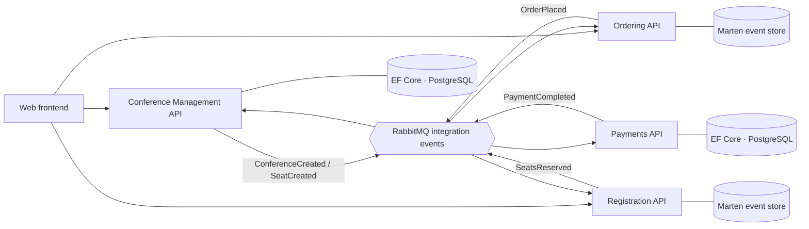

# CQRS Journey — Reloaded

[](https://github.com/ariellourenco/cqrs/actions/workflows/pipeline.yml)
[](https://codecov.io/gh/ariellourenco/cqrs)

A modern re-imagining of Microsoft's [CQRS Journey](https://github.com/microsoftarchive/cqrs-journey) conference-management
reference application, rebuilt on current .NET and today's recommended patterns. The destination is an architecture in the spirit of
[dotnet/eShop](https://github.com/dotnet/eShop): **.NET Aspire, microservices, Minimal APIs, and an integration-event bus** — but with
a hybrid CQRS write side that keeps the event-sourcing lessons the original was famous for.

This is a personal learning project: the goal is to explore modern .NET end to end, not to ship a product.

> [!NOTE]
> **Status: early / work in progress.** Today the repository contains the solution scaffolding and a partially implemented
> **Registration** domain. The full architecture below is the *target* — see [`ROADMAP.md`](ROADMAP.md) for the milestone-by-milestone
> plan and what comes next.

## What this project explores

- **Hybrid CQRS** — an event-sourced write side for the interesting contexts (Registration/Seats, Orders) and pragmatic EF Core CRUD
  for the rest (Conference Management, Payments).
- **Domain-Driven Design** — aggregates, domain events, and a saga/process manager coordinating a distributed workflow.
- **Microservices** communicating asynchronously through integration events over a message bus.
- **Modern .NET platform** — .NET 10, Minimal APIs with typed results, OpenAPI, central package management, and `.slnx` solutions.
- **Cloud-native local dev** — .NET Aspire orchestrating services, databases, and the broker, with OpenTelemetry, health checks, and
  service discovery out of the box.

## Target architecture



### Bounded contexts

| Context                           | Style                | Store              |
|-----------------------------------|----------------------|--------------------|
| Conference Management             | CRUD                 | EF Core            |
| Registration (Seats Availability) | Event Sourced        | Marten             |
| Orders & Registration Process     | Event Sourced + Saga | Marten             |
| Payments                          | CRUD                 | EF Core            |
| Conference (read side)            | Read model           | Marten projections |

## Tech stack

- [.NET 10](https://dotnet.microsoft.com/) / C# (preview language features)
- [.NET Aspire](https://learn.microsoft.com/dotnet/aspire/) — orchestration & observability *(planned)*
- ASP.NET Core Minimal APIs + [OpenAPI](https://learn.microsoft.com/aspnet/core/fundamentals/openapi/overview)
- [Marten](https://martendb.io) (event store) & [EF Core](https://learn.microsoft.com/ef/core/) on PostgreSQL *(planned)*
- RabbitMQ for integration events *(planned)*
- [xUnit v3](https://xunit.net) on the [Microsoft.Testing.Platform](https://learn.microsoft.com/dotnet/core/testing/microsoft-testing-platform-intro)

## Getting started

### Prerequisites

- [.NET SDK 10.0](https://dotnet.microsoft.com/download) (`global.json` pins the version; run `dotnet --version` to check)
- A Git client
- *(Once Aspire lands)* a container runtime such as Docker Desktop or Podman for the databases and broker

### Build

```bash
dotnet restore
dotnet build --configuration Release
```

### Test

Tests run on the Microsoft.Testing.Platform:

```bash
dotnet test --configuration Release
```

### Verify formatting

CI enforces `.editorconfig`; run this locally before committing to match it:

```bash
dotnet format Conference.slnx --verify-no-changes
```

## Repository layout

```text
.
├── Conference.slnx                 # Solution (.slnx format)
├── Directory.Build.props           # Shared MSBuild properties (TFM, analysis, nullable, …)
├── Directory.Packages.props        # Central package version management
├── global.json                     # Pinned .NET SDK + test runner
├── ROADMAP.md                      # Milestone-by-milestone plan
└── src
    ├── Infrastructure
    │   └── EventBus                 # Integration-event bus abstractions
    └── Services
        └── Registration            # First bounded context (Api · Domain · Tests)
```

## Contributing

This is primarily a personal learning repository, but issues and suggestions are welcome. Coding standards, conventions, and commit
guidelines live in [`.github/copilot-instructions.md`](.github/copilot-instructions.md) and `.editorconfig`.

## Credits

- The original [CQRS Journey](https://github.com/microsoftarchive/cqrs-journey) by Microsoft patterns & practices.
- [dotnet/eShop](https://github.com/dotnet/eShop) as the modern reference architecture.

## License

Licensed under the terms of the [LICENSE](LICENSE) file in this repository.
